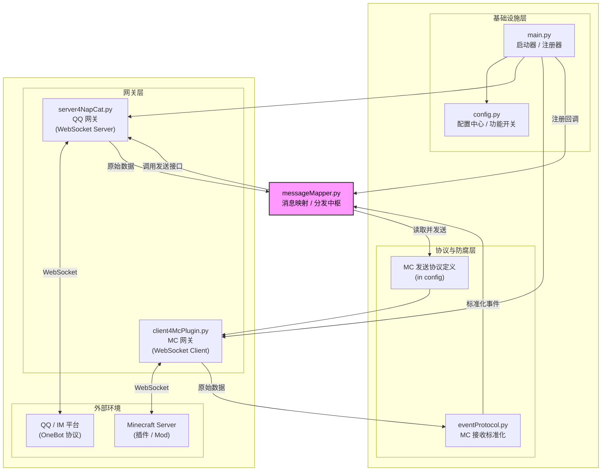

# LinkMC

🌍 English | [简体中文](./README.md)

一个基于 Python 的高度模块化、可扩展的 QQ 群与 Minecraft 服务器双向互通中枢。

本项目采用清晰的分层架构设计，旨在提供稳定基础互通功能的同时，为未来接入大型语言模型 (LLM) 智能体、图像处理等复杂功能预留接口。

## ✨ 特性 (Current Features)

目前项目处于 **第一阶段：基础互通与事件补齐**。

### 基础架构
- [x] **模块化设计**：网关层负责连接，协议层负责数据翻译，业务层负责逻辑分发，高度解耦。
- [x] **健壮连接**：MC 客户端网关内置自动断线重连机制，确保服务稳定性。
- [x] **配置中心化**：所有连接信息、开关、协议定义均在一个配置文件中管理。

### QQ → MC 方向
- [x] 基础群聊文本消息转发到 MC 服务器广播。
- [x] 自动过滤非目标群消息、富文本 (CQ码) 和链接，保持游戏内聊天屏整洁。

### MC → QQ 方向 (基于鹊桥 QueQiao 插件)
- [x] **全事件支持**：通过防腐层协议标准化 MC 事件数据。
- [x] **可配置转发**：可在 `config.py` 中独立开关以下事件的通知：
    - [x] 玩家聊天 (PlayerChatEvent)
    - [x] 玩家加入游戏 (PlayerJoinEvent)
    - [x] 玩家退出游戏 (PlayerQuitEvent)
    - [x] 玩家死亡播报 (PlayerDeathEvent) - *已本地化为中文提示*
    - [x] 玩家获得成就 (PlayerAchievementEvent)

## 🏗️ 架构概览

本项目采用了经典的分层架构模式：


*   **基础设施层**：负责程序的启动、任务调度和配置管理。
*   **网关层**：处理底层的 WebSocket 连接、鉴权和重连，不涉及业务逻辑。
*   **协议与防腐层**：抹平不同 MC 服务端版本的数据差异，向上层提供标准化的数据接口。
*   **业务逻辑层**：核心中枢，负责事件的过滤、加工、翻译和转发决策。

## 📋 前置要求

运行本项目需要以下环境：

1.  **Python 3.10+** (推荐使用较新版本以获得更好的异步性能)
2.  **Minecraft 服务器**
    *   已安装 [鹊桥 (QueQiao)](https://github.com/17TheWord/QueQiao) 插件 (或其他兼容该协议的 Websocket 插件)。
3.  **QQ 机器人环境**
    *   运行 [NapCat](https://github.com/NapNeko/NapCatQQ) 或其他兼容 OneBot 11 协议的框架。

## 🚀 快速开始

### 1. 安装依赖

克隆仓库后，安装所需的 Python 库：

```bash
pip install websockets
```
### 2. 配置文件

复制或直接修改根目录下的 config.py 文件，填入你的实际环境信息：

```bash
# config.py

# --- 转发配置 ---
TARGET_QQ_GROUP_ID = 123456789  # 你的目标 QQ 群号

# --- NapCat 连接配置 (Python作为服务端) ---
NAPCAT_WS_PORT = 6100           # NapCat 配置的正向 WS 端口
NAPCAT_WS_TOKEN = "your_token"  # NapCat 配置的 Token

# --- McPlugin 连接配置 (Python作为客户端) ---
McPlugin_WS_URI = "ws://127.0.0.1:6101" # 鹊桥插件的 WS 地址
McPlugin_WS_TOKEN = "your_token"        # 鹊桥插件配置的 Token

# --- MC 事件转发开关 (按需开启) ---
ENABLE_MC_CHAT_FORWARD = True
ENABLE_MC_JOIN_NOTICE = True
# ... 其他开关
```
### 3. 启动中枢
确认 QQ 侧和 MC 侧的服务均已启动后，运行主程序：

```bash
python main.py
```
看到类似以下的日志即表示连接成功：

```Text
[MainBridge] INFO: -> 业务回调注册完毕，中枢神经已连接。
[MainBridge] INFO: ✅ 所有底层子模块启动完毕，双向转发中枢开始运行。
[NapCatServer] INFO: [连接管理] NapCat 已连接: 127.0.0.1:xxxxx
[McPluginClient] INFO: [连接成功] 已连接到 MC 插件! 双向通道建立。
```

## 🗺️ 开发路线图 (Roadmap)

本项目将按阶段进行迭代开发：

*   [x] **阶段一：基础互通 (已完成)**
    *   搭建模块化架构框架。
    *   实现基础的双向文本通信。
    *   补齐 MC 侧主要事件 (加入、退出、死亡、成就) 并实现配置化开关。

*   [ ] **阶段二：QQ 侧功能增强**
    *   实现 QQ 富文本解析（处理 @、回复引用）。
    *   表情符号自动替换为颜文字。
    *   处理拍一拍等通知事件。

*   [ ] **阶段三：MC 侧接口补齐**
    *   封装并启用 RCON 命令执行接口。
    *   封装 Title (标题)、Actionbar (状态栏) 消息接口。
    *   实现 QQ 群到 MC 的私聊功能。

*   [ ] **阶段四：多媒体交互**
    *   实现 QQ 图片转 Minecraft 地图画并在游戏内显示。
    *   探索 MC 游戏内截图反向发送到 QQ 群。

*   [ ] **阶段五：智能体集成**
    *   接入 LLM API。
    *   实现游戏内的智能 AI 玩家/助手，支持上下文对话。

## 📄 许可证

[MPL 2.0](LICENSE)
